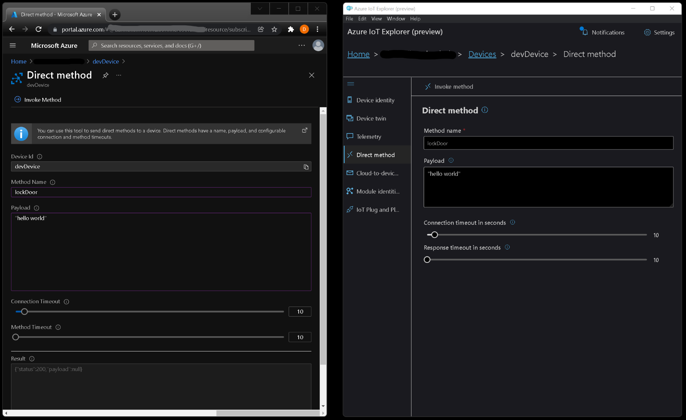

# Receive method invocation

IoT Hub gives you the ability to invoke direct methods on devices from the cloud. Direct methods represent a request-reply interaction with a device similar to an HTTP call in that they succeed or fail immediately (after a user-specified timeout). This approach is useful for scenarios where the course of immediate action is different depending on whether the device was able to respond.

Direct methods follow a request-response pattern and are meant for communications that require immediate confirmation of their result. For example, interactive control of the device, such as turning a fan on and off.

Also note, that all of these examples use the [connection string](../connections/connection_string.js) method to create a connection client. See the [connections](../connections) section if you want use a different connection method.

# 🦉 Getting setup

Before you can run any of the samples, you will need to setup and configure a few things.

> tip: right click and open in new tab

- [Setup IoT Hub and devices](../../../../doc/device-samples/iot-hub-prerequisites.md)
- [Setup your local environment](../../../../doc/device-samples/dev-environment.md)

Before you get started, make sure you set the following environmental variables. [Click here](../../../../doc/device-samples/setting-env-variables.md) if you need help setting environment variables.

| Env variable                    | Description                                                                                                                                                                                                         |
| :------------------------------ | :------------------------------------------------------------------------------------------------------------------------------------------------------------------------------------------------------------------ |
| IOTHUB_DEVICE_CONNECTION_STRING | The connection string for your IoT Hub device. It contains the Hostname, Device Id & Device Key in the following format:<br/><br/>`"HostName=<iothub_host_name>;DeviceId=<device_id>;SharedAccessKey=<device_key>"` |

# 🌟 Samples

### Reveive method invocation

This sample allows you invoke methods on the device from a request in the cloud. For example, interactive control of the device, such as turning a fan on and off.

#### Running the sample

From the `getting started/src/receive method invocation` directory, run `node receive_method.js`

You should then see the following message in the terminal:

```text
Connected to device. Registering handlers for methods.
Ready to recieve method invocation...
```

Next, you need to send a message from the cloud to your device. You can do this from either Azure IoT Explorer or Azure Portal.

- Method name: `fanOn`
- Payload: `"hello world"`

> For simplicity in this sample, we are not handling the payload contents, so any JSON formatted payload will work.



Click **Invoke method**. When the device recieves the message, the handler invokes the method. You should then see the following message in your terminal:

```text
Received method call for method 'fanOn'
Payload:
hello world
Response to method 'fanOn' sent successfully.
```

# 📖 Further reading

- [Understand and invoke direct methods from IoT Hub](https://docs.microsoft.com/en-us/azure/iot-hub/iot-hub-devguide-direct-methods?WT.mc_id=Portal-Microsoft_Azure_IotHub)

# 👉 Next Steps

- [Device twins](../device%20twins)
- [More getting started samples](../../)
