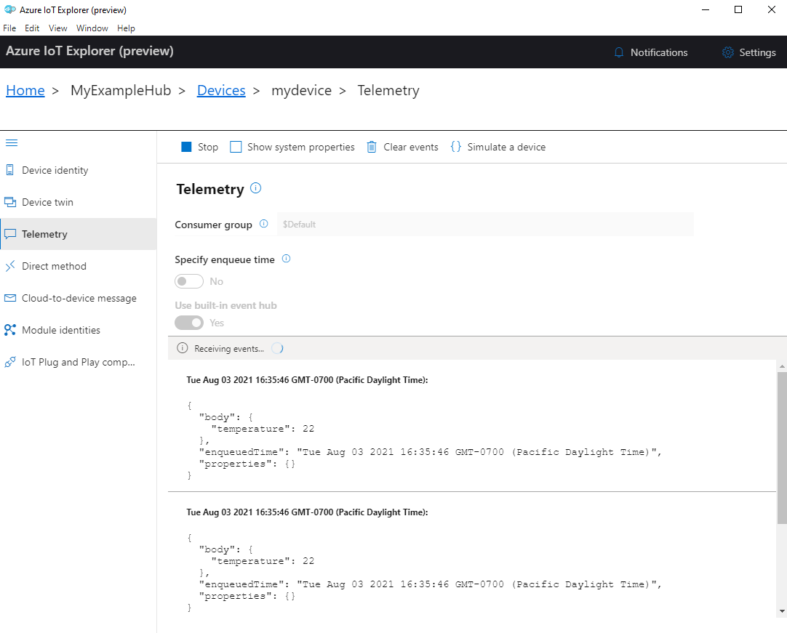

To view the device telemetry sent to IoT Hub, you can use the Azure IoT CLI extension or IoT Explorer.

# CLI to Monitor IoT hub events

To view device telemetry with Azure CLI:

1. Install the [Azure CLI](https://docs.microsoft.com/en-us/cli/azure/install-azure-cli)

2. Install the [Azure IoT extension for Azure CLI](https://github.com/Azure/azure-iot-cli-extension).

3. Run the [az iot hub monitor-events](https://docs.microsoft.com/en-us/cli/azure/iot/hub?view=azure-cli-latest#az_iot_hub_monitor_events) command to monitor events sent from the device to your IoT hub. Use the names that you created previously in Azure IoT for your device and IoT hub.

    ```bash
    az iot hub monitor-events --output table --device-id mydevice --hub-name {YourIoTHubName}
    ```
4. View the connection details and telemetry output in the console.

    ```
    Starting event monitor, filtering on device: mydevice, use ctrl-c to stop...
    event:
        component: ''
        interface: dtmi:com:example:TemperatureController;1
        module: ''
        origin: mydevice
        payload: '{"workingSet":1251}'

    event:
        component: thermostat1
        interface: dtmi:com:example:TemperatureController;1
        module: ''
        origin: mydevice
        payload: '{"temperature":22.00}'
    ```

# IoT Explorer

You can view the device telemetry with IoT Explorer. See the [IoT Explorer page](https://docs.microsoft.com/en-us/azure/iot-fundamentals/howto-use-iot-explorer) for details on what IoT Explorer is and how to install it.

To view telemetry in Azure IoT Explorer:

1. [Connect IoT Explorer](https://docs.microsoft.com/en-us/azure/iot-fundamentals/howto-use-iot-explorer#connect-to-your-hub) to your IoT hub instance.

2. From your IoT hub in IoT Explorer, select **View devices in this hub**, then select your device from the list.

3. On the left menu for your device, select **Telemetry**.

4. Confirm that Use **built-in event hub** is set to *Yes* and then select **Start**.

5. View the telemetry as the device sends messages to the cloud.

    

6. Select **Stop** to end receiving events.