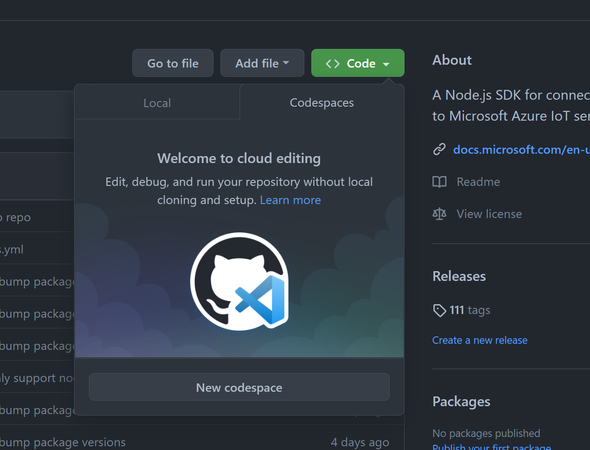

# Samples for the Azure IoT device SDK for Node.js

## Run samples using GitHub codespaces

You can use Github Codespaces to be up and running quickly! Here are the steps to follow.

**1) Make sure you have the prerequisites**

In order to run the device samples you will first need the following prerequisites:

- An Azure IoT Hub instance. [(Link if you don't.)](https://docs.microsoft.com/en-us/azure/iot-hub/iot-hub-create-through-portal)
- A device identity for your device. [(Link if you don't.)](https://docs.microsoft.com/en-us/azure/iot-hub/iot-hub-create-through-portal#register-a-new-device-in-the-iot-hub)

**2) Create and open Codespace**

- Select the Codespaces tab and the "New codespace" button

  

- Once the Codespace is open, all required packages to run the samples will be setup for you

**3) Set the IOTHUB_DEVICE_CONNECTING_STRING environment variable**

- From a shell or Node.js command prompt, navigate to the folder where you placed the sample files.
- Set the `IOTHUB_DEVICE_CONNECTING_STRING` environment variable:

```bash
export IOTHUB_DEVICE_CONNECTING_STRING="<YourIoTHubDeviceConnectionString>"
```

**4) Run it**

Run the sample application using the following commands:

_for JavaScript_

```bash
cd device/samples/javascript
node simple_sample_device.js
```

_for TypeScript_

```bash
cd device/samples/typescript/dist
node simple_sample_device.js
```

## Run samples locally

_How to run a sample in your own folder using published npm packages._

**1) Make sure you have the prerequisites**

In order to run the device samples you will first need the following prerequisites:

- The latest or LTS version of Node.js on your device. (Check out [Nodejs.org](https://nodejs.org/) for more info)
- An Azure IoT Hub instance ([Link if you don't](https://docs.microsoft.com/en-us/azure/iot-hub/iot-hub-create-through-portal))
- A device identity for your device ([Link if you don't](https://docs.microsoft.com/en-us/azure/iot-hub/iot-hub-create-through-portal#register-a-new-device-in-the-iot-hub))
- Clone this repo to your local machine

**2) Install dependencies**

You need to install proper dependencies as defined in the **package.json**. Run the following commands:

_for JavaScript_

```
cd device/samples/javascript
npm install
```

_for TypeScript_

```
cd device/samples/typescript
npm install
```

**3) Set the IOTHUB_DEVICE_CONNECTING_STRING environment variable**

- From a shell or Node.js command prompt, navigate to the folder where you placed the sample files.
- Set the `IOTHUB_DEVICE_CONNECTION_STRING` environment variable:

_in bash_

```bash
export IOTHUB_DEVICE_CONNECTION_STRING="<YourIoTHubDeviceConnectionString>"
```

_in powershell_

```powershell
$env:IOTHUB_DEVICE_CONNECTION_STRING="<YourIoTHubDeviceConnectionString>"
```

**4) Build it**

For the TypeScript samples, we need to run the `build` command to transpile the TypeScript code into the JavaScript files:

```
npm run build
```

The JavaScript files are placed into the `dist` folder.

**5) Run it**

Run the sample application using the following commands:

JavaScript

```bash
node simple_sample_device.js
```

TypeScript

```bash
cd dist
node simple_sample_device.js
```

## List of available samples

### **Simple send and receive messages...**

| Sample                        | Description                                                                                                                         | JavaScript | TypeScript |
| ----------------------------- | ----------------------------------------------------------------------------------------------------------------------------------- | :--------: | :--------: |
| simple_sample_device          | Connect to IoT Hub and send and receive messages.                                                                                   |     ✔      |     ✔      |
| simple_sample_device_with_sas | Connect using a SAS Token to IoT Hub and send and receive messages.                                                                 |     ✔      |     ✔      |
| simple_sample_device_x509     | Connect using an X-509 certificate to IoT Hub and send and receive messages.                                                        |     ✔      |     ✔      |
| send_batch_http               | Connect to IoT Hub and send a batch of messages over an HTTP connection.                                                            |     ✔      |     ✔      |
| remote_monitoring             | Implements the device code used to connect to an [Azure IoT Suite Remote Monitoring preconfigured solution][remote-monitoring-pcs]. |     ✔      |     ✔      |
| edge_downstream_device        | Connect a downstream device to IoT Edge and send and receive messages.                                                              |     ✔      |     ✔      |
| device_through_proxy          | Connect to IoT Hub and send and recieve messages through a proxy                                                                    |     ✔      |            |

### **Device services samples (Device Twins, Methods, and Device Management)...**

| Sample                     | Description                                                                                                                                                                                                                                             | JavaScript | TypeScript |
| -------------------------- | ------------------------------------------------------------------------------------------------------------------------------------------------------------------------------------------------------------------------------------------------------- | :--------: | :--------: |
| simple_sample_device_twin  | Shows how to synchronize a Device Twin with Azure IoT Hub on a device. See the [backend service helper project](./helpers/device-twin-service/Readme.md) that works along side this sample.                                                                                                                                                                                   |     ✔      |     ✔      |
| device_method              | Shows how to implement an Azure IoT Hub Cloud to Device Direct Method on a device.                                                                                                                                                                      |     ✔      |     ✔      |
| dmpatterns_reboot_device   | Shows how a device handles a C2D method to reboot and provides progress updates through twin reported properties. See [device management patterns][dm-patterns] for instructions on running the device management patterns samples.                     |     ✔      |     ✔      |
| dmpatterns_fwupdate_device | Shows how a device handles a C2D method to initiate a firmware update and provides progress updates through twin reported properties. See [device management patterns][dm-patterns] for instructions on running the device management patterns samples. |     ✔      |     ✔      |

### **Plug and play examples**

| Sample                     | Description                                       | JavaScript | TypeScript |
| -------------------------- | ------------------------------------------------- | :--------: | :--------: |
| pnp_simple_thermostat      | Simple example of enabling PnP on a device        |     ✔      |     ✔      |
| pnp_temperature_controller | More advanced example of enabling PnP on a device |     ✔      |     ✔      |

### **Uploading blob to Azure...**

| Sample                      | Description                                                           | JavaScript | TypeScript |
| --------------------------- | --------------------------------------------------------------------- | :--------: | :--------: |
| upload_to_blob (deprecated) | Uploads a blob to Azure through IoT Hub                               |     ✔      |     ✔      |
| upload_to_blob_advanced     | More advanced scenario for greater control over the blob upload calls |     ✔      |     ✔      |

# IoT Plug And Play device samples

[](https://docs.microsoft.com/azure/iot-develop/)

These samples demonstrate how a device that follows the [IoT Plug and Play conventions](https://docs.microsoft.com/azure/iot-pnp/concepts-convention) interacts with IoT Hub or IoT Central, to:

- Send telemetry.
- Update read-only and read-write properties.
- Respond to command invocation.

The samples demonstrate two scenarios:

- An IoT Plug and Play device that implements the [Thermostat](https://devicemodels.azure.com/dtmi/com/example/thermostat-1.json) model. This model has a single interface that defines telemetry, read-only and read-write properties, and commands.
- An IoT Plug and Play device that implements the [Temperature controller](https://devicemodels.azure.com/dtmi/com/example/temperaturecontroller-2.json) model. This model uses multiple components:
  - The top-level interface defines telemetry, read-only property and commands.
  - The model includes two [Thermostat](https://devicemodels.azure.com/dtmi/com/example/thermostat-1.json) components, and a [device information](https://devicemodels.azure.com/dtmi/azure/devicemanagement/deviceinformation-1.json) component.

### Quickstarts and tutorials

To learn more about how to configure and run the Thermostat device sample with IoT Hub, see [Quickstart: Connect a sample IoT Plug and Play device application running on Linux or Windows to IoT Hub](https://docs.microsoft.com/azure/iot-pnp/quickstart-connect-device?pivots=programming-language-javascript).

To learn more about how to configure and run the Temperature Controller device sample with:

- IoT Hub, see [Tutorial: Connect an IoT Plug and Play multiple component device application running on Linux or Windows to IoT Hub](https://docs.microsoft.com/azure/iot-pnp/tutorial-multiple-components?pivots=programming-language-javascript)
- IoT Central, see [Tutorial: Create and connect a client application to your Azure IoT Central application](https://docs.microsoft.com/azure/iot-central/core/tutorial-connect-device?pivots=programming-language-javascript)

### Configuring the samples

Both samples use environment variables to retrieve configuration.

- If you are using a connection string to authenticate:

  - set IOTHUB_DEVICE_SECURITY_TYPE="connectionString"
  - set IOTHUB_DEVICE_CONNECTION_STRING="\<connection string of your device\>"

- If you are using a DPS enrollment group to authenticate:
  - set IOTHUB_DEVICE_SECURITY_TYPE="DPS"
  - set IOTHUB_DEVICE_DPS_ID_SCOPE="\<ID Scope of DPS instance\>"
  - set IOTHUB_DEVICE_DPS_DEVICE_ID="\<Device's ID\>"
  - set IOTHUB_DEVICE_DPS_DEVICE_KEY="\<Device's security key \>"
  - _OPTIONAL_, if you do not wish to use the default endpoint "global.azure-devices-provisioning.net"
    - set IOTHUB_DEVICE_DPS_ENDPOINT="\<DPS endpoint\>"

### Caveats

- Azure IoT Plug and Play is only supported for MQTT and MQTT over WebSockets for the Azure IoT Node Device SDK. Modifying these samples to use AMQP, AMQP over WebSockets, or HTTP protocols **will not work**.
- When the thermostat receives a desired temperature, it has no actual affect on the current temperature.
- The command `getMaxMinReport` allows the application to specify statistics of the temperature since a given date. To keep the sample simple, we ignore this field and instead return statistics from the entire lifecycle of the executable.
- The temperature controller implements a command named `reboot` which takes a request payload indicating the delay in seconds. The sample will ignore this command.

# Read More

For more information on how to use this library refer to the documents below:

- [Prepare your node.js development environment][node-devbox-setup]
- [Setup IoT Hub][lnk-setup-iot-hub]
- [Provision devices][lnk-manage-iot-hub]
- [Node API reference][node-api-reference]
- [Debugging with Visual Studio Code][debug-with-vscode]
- [Use the iothub-explorer command line tool][iothub-explorer]

[lnk-setup-iot-hub]: https://aka.ms/howtocreateazureiothub
[lnk-manage-iot-hub]: https://aka.ms/manageiothub
[remote-monitoring-pcs]: https://docs.microsoft.com/en-us/azure/iot-suite/iot-suite-remote-monitoring-sample-walkthrough
[node-api-reference]: https://docs.microsoft.com/en-us/javascript/api/azure-iot-device/
[iothub-explorer]: https://github.com/azure/iothub-explorer
[debug-with-vscode]: ../../doc/node-debug-vscode.md
[node-devbox-setup]: ../../doc/node-devbox-setup.md
[dm-patterns]: ../../doc/dmpatterns.md
