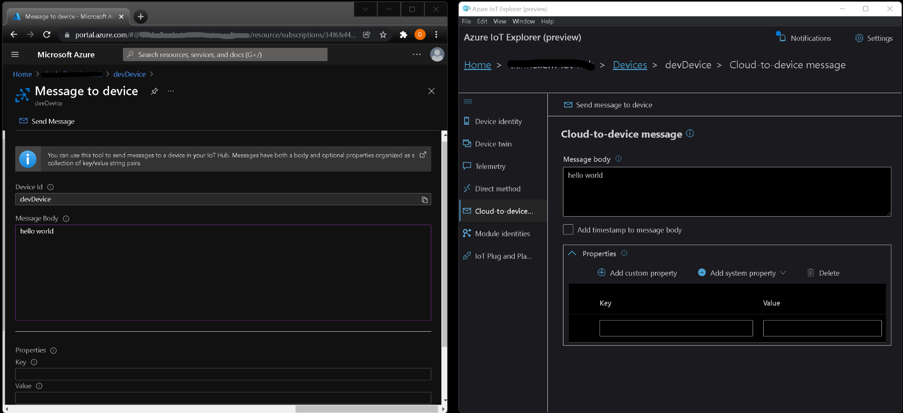

# Receive messages

IoT Hub gives you the ability to send one-way notifications to a device app from your solution back end, send cloud-to-device messages from your IoT hub to your device.

Try a different approach. Instead of recieving messages, receive a [cloud to device method invocation](../receive_0method_invocation).

Note, that these examples use the [connection string](../connections/connection_string.js) method to create a connection client. See the [connections](../connections) section if you want use a different connection method.

# 🦉 Getting setup

Before you can run any of the samples, you will need to setup and configure a few things.

> tip: right click and open in new tab

- [Setup IoT Hub and devices](../../../../doc/devicesamples/iot-hub-prerequisites.md)
- [Setup your local environment](../../../../doc/devicesamples/dev-environment.md)

Before you get started, make sure you set the following environmental variables. [Click here](../../../../doc/devicesamples/setting-env-variables.md) if you need help setting environment variables.

| Env variable                    | Description                                                                                                                                                                                                         |
| :------------------------------ | :------------------------------------------------------------------------------------------------------------------------------------------------------------------------------------------------------------------ |
| IOTHUB_DEVICE_CONNECTION_STRING | The connection string for your IoT Hub device. It contains the Hostname, Device Id & Device Key in the following format:<br/><br/>`"HostName=<iothub_host_name>;DeviceId=<device_id>;SharedAccessKey=<device_key>"` |

# 🌟 Samples

### Receive message

This sample allows you recieve messages on your a device from a sender in the cloud.

#### Running the sample

From the `getting_started/src/receive_messages` directory, run `node receive_message.js`

You should then see the following message in the terminal:

```text
Connected to device. Registering message handler.
Ready to recieve messages...
```

Next, you need to send a message from the cloud to your device. You can do this from either Azure IoT Explorer or [Azure Portal](../../../../doc/devicesamples/send-message-with-azure-portal.md).

- Message body: `hello world`



Click **Send message to device**. When the device recieves the message, the registered message handler will process the request. You should then see the following message in your terminal:

```text
Received C2D message:
 message: hello world
 properties: []
```

# 📖 Further reading

- [Send cloud-to-device messages with IoT Hub (Node.js)](https://docs.microsoft.com/en-us/azure/iot-hub/iot-hub-node-node-c2d)
- [Understand and invoke direct methods from IoT Hub](https://docs.microsoft.com/en-us/azure/iot-hub/iot-hub-devguide-messaging)
- [Send cloud-to-device messages from an IoT hub](https://docs.microsoft.com/en-us/azure/iot-hub/iot-hub-devguide-messages-c2d)

# 👉 Next Steps

- [Receive cloud to device method invocation](../receive_method_invocation)
- [More getting started samples](../../)

# 💬 Feedback

If you have any feedback or questions about our device samples, please [post it here](https://github.com/Azure/azure-iot-sdk-node/discussions/1042).