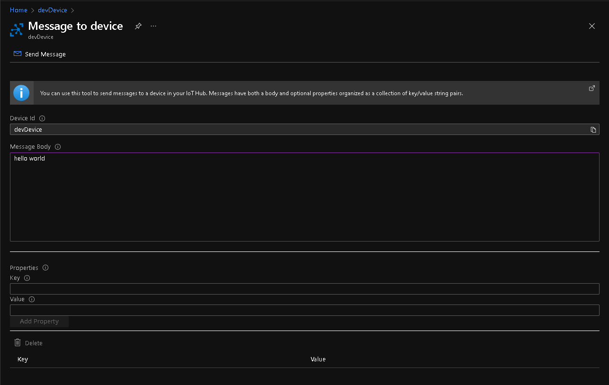
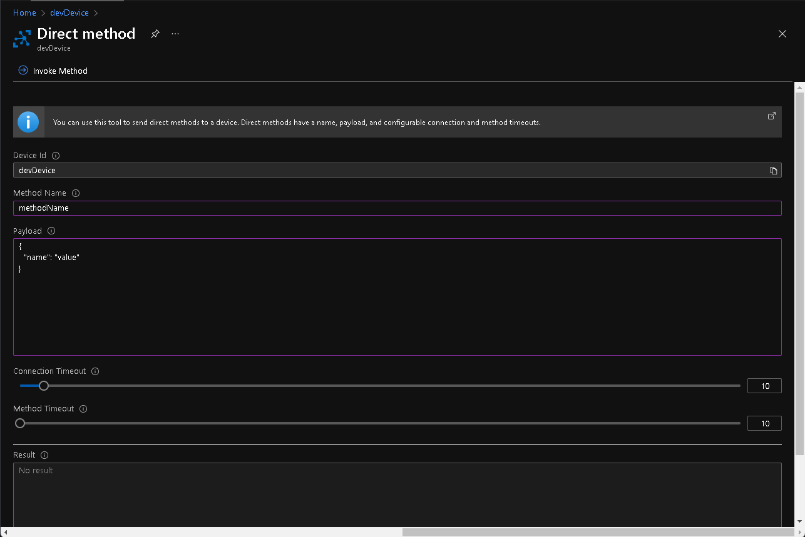

You can use Azure Portal to send messages and direct methods to a device.

# Send message

1. Open [Azure Portal](https://portal.azure.com/) and select your IoT Hub instance.

2. Under the **Device management** section in the left navigation, click **Devices**.

3. Select the device you want to send a message to.

4. From the top navigation, click **Message to Device**.

5. Enter your message into the **Message Body** field.

    

6. Click **Send Message**

# Direct method

1. Open [Azure Portal](https://portal.azure.com/) and select your IoT Hub instance.

2. Under the **Device management** section in the left navigation, click **Devices**.

3. Select the device you want to send a message to.

4. From the top navigation, click **Direct method**.

5. Enter values for **Method Name** and **Payload** fields.

    

6. Click **Invoke Method**.