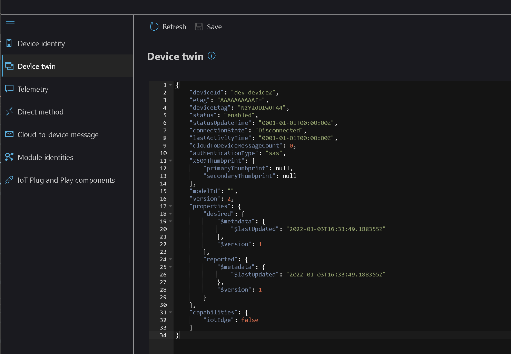

You can use Azure IoT Explorer to view a device twin.

# Device twin

Download and install [Azure IoT Explorer](https://docs.microsoft.com/en-us/azure/iot-fundamentals/howto-use-iot-explorer) 

1. Open Azure IoT Explorer.

2. Select the IoT Hub instance.

3. Select or create a new device.

4. Select the  **Device twin** item in the left navigation.

    

5. Use the "Refresh" link to reload json if you have made a change to the twin. 