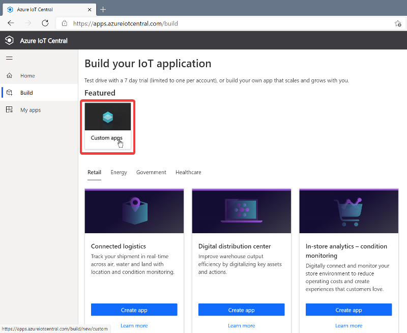
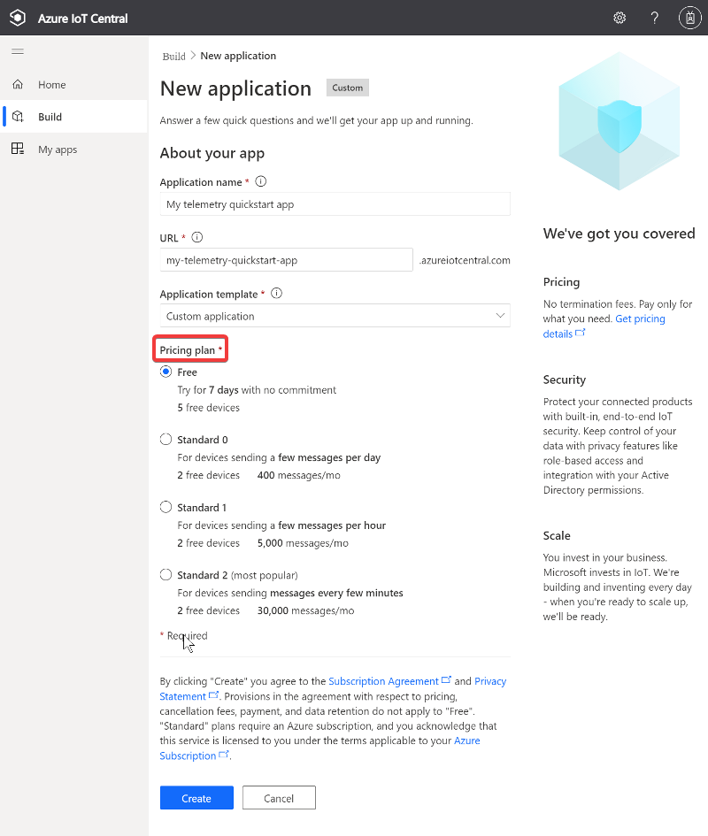
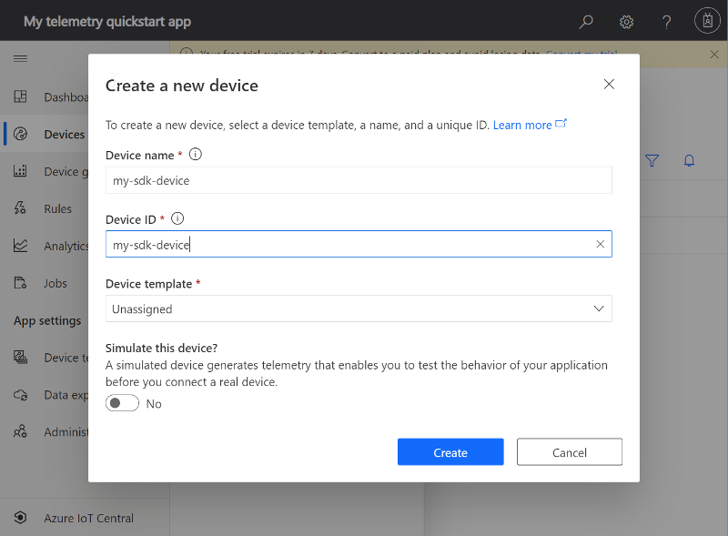
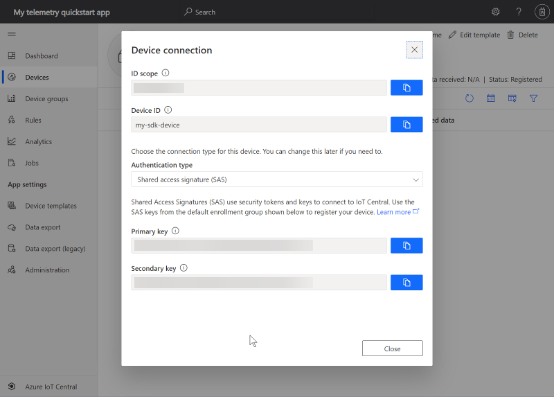

# 🔨 Create IoT Central application

This is an abbreviated description on how to create an IoT Central application using the Azure portal. [Click here](https://docs.microsoft.com/en-us/azure/iot-develop/quickstart-send-telemetry-central?pivots=programming-language-nodejs) for the in-depth walk through. 

1. Browse to [Azure IoT Central](https://apps.azureiotcentral.com/) and sign in with a Microsoft personal, work, or school account.

2. Navigate to Build and select Custom apps.

   

3. In **Application name**, enter a unique name or use the generated name.

4. In URL, enter a memorable application URL prefix or use the generated URL prefix.

5. Leave Application template set to Custom application.

6. Select a Pricing plan option. To use the application for free for seven days, select Free. You can convert a free application to standard pricing before it expires.

   

7. Select **Create**

# 📲 Add new device

Now you need to add a new device to your IoT Central application. The device is an instance of a device template that represents a device that you'll connect to the application.

1. In the left pane select **Devices**, then select **+New**.

2. Leave **Device template** set to *Unassigned* and **Simulate this device?** set to *No*.

3. Set a friendly **Device name** and **Device ID**. Optionally, use the generated values.
   
   

4. Select **Create**.

# 🔌 Get device connection details

1. In the **All devices** list, click the linked device name to display details.

2. In the top menu, select **Connect**.

   The **Device connection** dialog displays the connection details:

    

3. Copy the following values from the **Device connection** dialog to a safe location. You'll use these values to connect your device to IoT Central.

   - `ID scope`
   - `Device ID`
   - `Primary key`