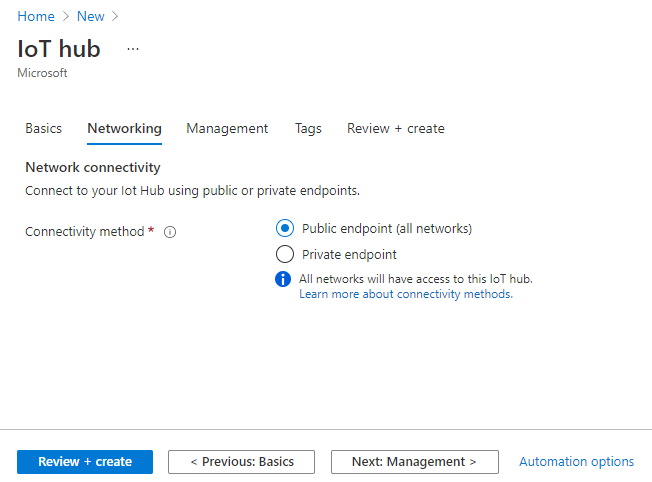
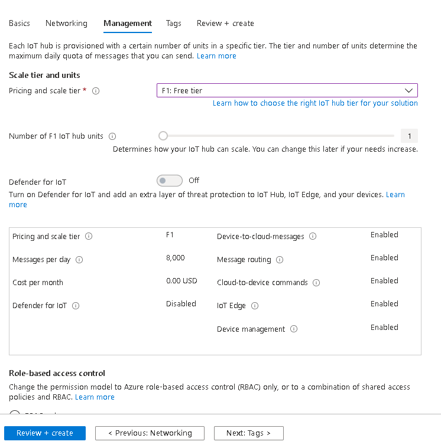
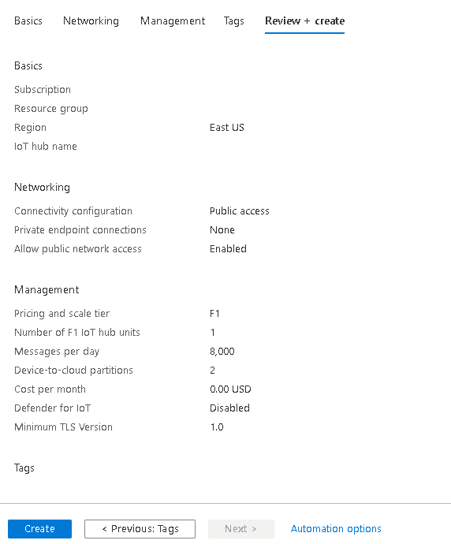
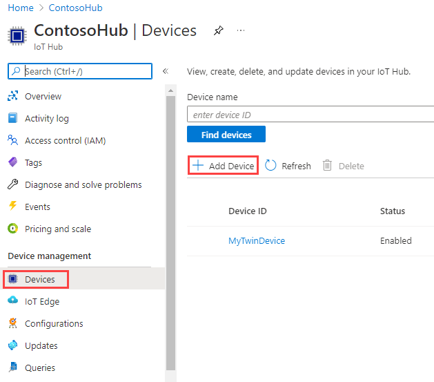
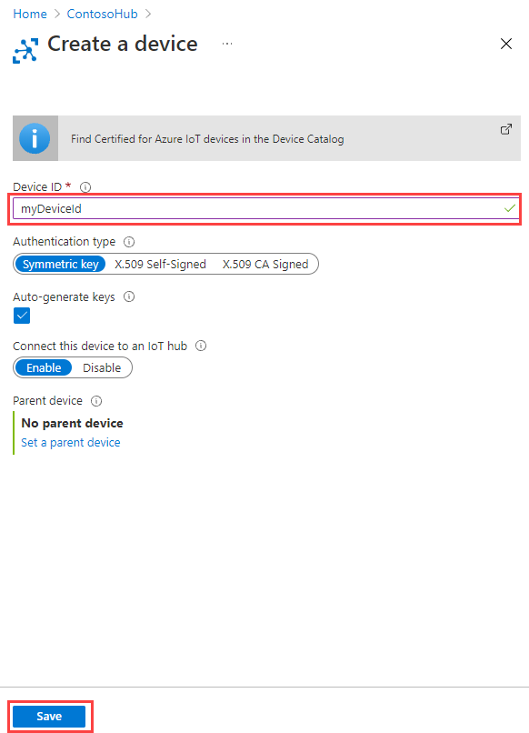
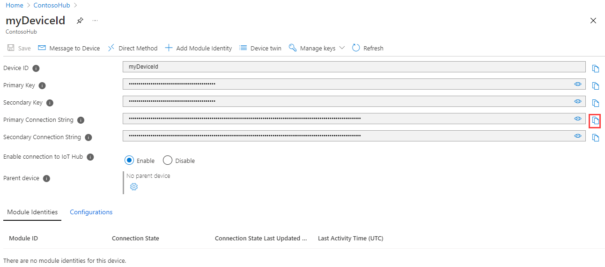

# 🔨 Create an IoT hub

This is an abbreviated description on how to create an IoT hub using the Azure portal. [Click here](https://docs.microsoft.com/en-us/azure/iot-hub/iot-hub-create-through-portal) for the in-depth walk through. 

1. Sign in to the Azure portal.

2. From the Azure homepage, select the + Create a resource button, and then enter IoT Hub in the Search the Marketplace field.

3. Select IoT Hub from the search results, and then select Create.

4. On the Basics tab, complete the fields as follows:   

   

5. Select **Next: Networking** to continue creating your hub. Choose the endpoints that devices can use to connect to your IoT Hub. **Public endpoint (all networks)** is a good a start.

   

6. Select **Next: Management** to continue creating your hub. Here you can choose your pricing tier. Since this is just for running samples, select the free tier.

   

7. Select **Review + create** to review your hub. Then click **Create**.

   

# 📲 Register a new device in the IoT hub

In this section, you create a device identity in the identity registry in your IoT hub. A device cannot connect to a hub unless it has an entry in the identity registry. For more information, see the [IoT Hub developer guide](https://docs.microsoft.com/en-us/azure/iot-hub/iot-hub-devguide-identity-registry#identity-registry-operations).

1. In your IoT hub navigation menu, open **Devices**, then select **Add Device** to add a device in your IoT hub.

    

2. In **Create a device**, provide a name for your new device, such as **myDeviceId**, and select **Save**. This action creates a device identity for your IoT hub. Leave **Auto-generate keys** checked so that the primary and secondary keys will be generated automatically.

   

3. After the device is created, open the device from the list in the **Devices** pane. Copy the **Primary Connection String**. This connection string is used by device code to communicate with the hub.

   

# 🔎 Other ways to create an IoT hub

- [Create an IoT hub using the Azure IoT Tools for Visual Studio Code](https://docs.microsoft.com/en-us/azure/iot-hub/iot-hub-create-use-iot-toolkit)
- [Create an IoT hub using the New-AzIotHub cmdlet](https://docs.microsoft.com/en-us/azure/iot-hub/iot-hub-create-using-powershell)
- [Create an IoT hub using the Azure CLI](https://docs.microsoft.com/en-us/azure/iot-hub/iot-hub-create-using-cli)
