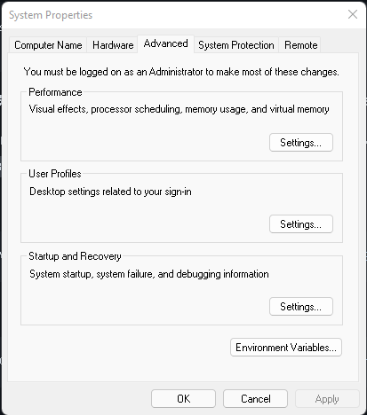
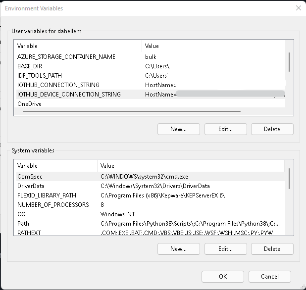
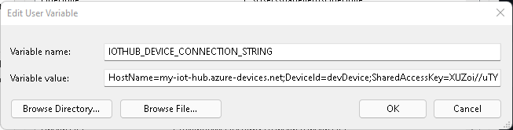

# Setting up environment variables

Environment vairables are a handy way to set variable values that are unique for you environment. Instead of cutting and pasting the value into each sample, you can set an environment vairable once so that is used throughout the different samples.

For most samples, by default, you need to just set the `IOTHUB_DEVICE_CONNECTION_STRING` environment variable. This is the connection string for the device you registered in IoT hub. 

There are samples that require other or more environment variables to be set. They will be specifically called out in the sample.

### In bash
```bash
export IOTHUB_DEVICE_CONNECTION_STRING="<YourIoTHubDeviceConnectionString>"
```

### In Powershell
```powershell
$env:IOTHUB_DEVICE_CONNECTION_STRING="<YourIoTHubDeviceConnectionString>"
```

### Manually in Windows

1. Open System properties and click on **Environment Variables**

    

2. Under the **User variables** section, click **New...**

    

3. Enter the **Variable name:** and **Variable value:**. Click **Ok** to save.

    

4. Close and and re-open any existing console or terminal windows.