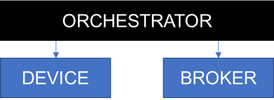

# Mean Time to Recovery SDK Metric Tests in MQTT

This is a testing suite to measure the mean time to recovery of the Node.js Device Client. The mean time to recovery can be defined as the average time it takes for the Device Client to recover (by acknowledging an unacknowledged but sent message) after the broker is reconnected from a period of "disconnection". There are alot of assumptions made to control the way this metric is collected, including Operating System, message timing, ping timers, etc., and beacuse there are alot of moving variables this metric is averaged to get a "good idea" of the mean time for the Device Client to recover.

## Abstract

The testing suite has an "orchestrator" that then manages two "child" processes. The "orchestrator" will start a MQTT device, and then using Aedes, start a MQTT Broker.\*



The way the testing suite works, a broker and a device are created as subprocesses. The orchestrator sends commands to and from the device subprocess in order to communicate when messages should be sent. Instead of sending messages to the subprocess for the broker, the orchestrator simply controls the subprocess itself, killing the broker when we want to simulate the broker "going down". It is important to note the affect of killing the broker in Windows can be very different than Linux for instance, since the way the TLS stack responds to the lost connection will be different.

The orchestrator will instruct the device device will send a test message as a form of a "ping", to ensure that the device is working and that the broker ('aedes_server') is responding. Once this is done, we can go ahead and kill the server. Immediately after killing the server a instruction is sent to the device to send a message. This message should not be acknowledged ('acked') until after the server has been back online. Once the specified 'down' time has elapsed, the server process will be re-established, and the message should be acknowledged. When this happens the device will record the time that the message was acknowledged as the "time the device recovered". It will send this information to the orchestrator, which will record the difference between the time the server process was re-established and the time the message was acknowledged as the "mean time to recovery". This whole process will be repeated multiple times depending on the for loop configuration in the orchestrator code.

\*there is no dockerization of these processes. This test could be tweaked to work with the "device" and "broker" running in separate docker containers on the same machine, but the added complexity is unnecessary and will make integration with testing pipelines more challenging.

## Generate the server certs

I used the following documentation to quickly generate the server certs: [Generating a self-signed certificate using OpenSSL](https://www.ibm.com/support/knowledgecenter/SSMNED_5.0.0/com.ibm.apic.cmc.doc/task_apionprem_gernerate_self_signed_openSSL.html)

The output you should result in is a `key.pem` file and a `certificate.pem` file in this folder. Also ensure that the server's common name is set to "localhost", to prevent any authentication issues from the device.

## To Run (Using Powershell)

1. Set the environment variables

```powershell
& $ENV:NODE_EXTRA_CA_CERTS="./certificate.pem"
& $ENV:DEBUG="orchestrator, device, aedes_server"
```

2. Run the orchestrator

```powershell
& node orchestrator.js
  aedes_server server started and listening on port 8883 +0ms
  device message received on child  { setKeepAlive: 20 } +0ms
  ...
```
